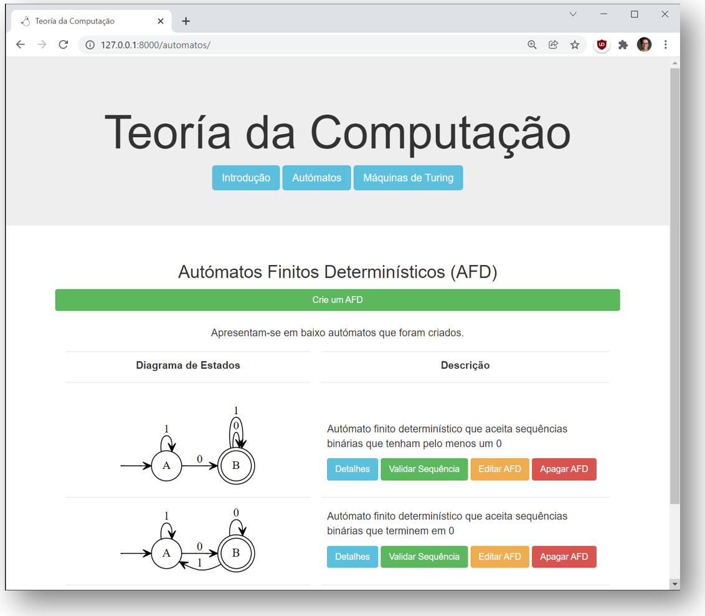

# Web app de Teoria da Computação
Web App base em Django para website de Teoria da Computação



### Passos para lançar e editar a aplicação
1. Abra a linha de comandos (PowerShell ou cmd)
1. Descarregue uma cópia (clone) do repositório com o comando `git clone https://github.com/teoria-da-computacao/tc-django` ou descarregue o projeto como um zip e descompacte
1. Entre na pasta  `cd tc-django`
2. Crie e instale um ambiente virtual. Use o venv ou o pipenv.
3. com venv
    1. Crie um ambiente virtual python -m venv virtual
    1. Active o ambiente virtual virtual\Scripts\activate
    1. Instale o django `python -m pip install django`
    2. Instale o graphviz `python -m pip install graphviz`
4. com pipenv 
    1. Instale o pipenv `python -m pip install pipenv`
    1. Crie um ambiente virtual com o django instalado `pipenv install django`
    1. Active o ambiente virtual `pipenv shell`
    2. Instale o graphviz `pipenv install graphviz`
5. Lance a aplicação no browser com o comando `python manage.py runserver`
6. abra a pasta com o Pycharm, ou com o comando `pycharm .`

### Passos para criar uma nóva página na aplicação
1. no ficheiro `views.py` crie uma nova função que renderize a nova página
2. na pasta `website\templates\website` crie uma página HTML correspondente para ser renderizada, extendendo o layout base (veja como é feito nas outras páginas)
3. no ficheiro `website\urls.py` crie um novo `path` para o novo URL
4. no ficheiro `layout.html` (que está na pasta `website\templates\website`) atualize o menu de navegação, inlcuindo um link para a nova página


### App a correr no  Heroku com pipenv ⛅
Execute os seguintes comandos para pôr o seu projeto e app a correr na cloud!
1. considera-se que tem o Heroku instalado. Na consola, faça login `heroku login`
2. Instale o servidor gunicorn	`pipenv install gunicorn`
3. Crie na pasta lab6 o ficheiro `Procfile` (sem qualquer extensão!) com o seguinte conteúdo (que especifica que estamos a usar Gunicorn): `web: gunicorn config.wsgi --log-file -`
4. em config/settings.py, pôr: `ALLOWED_HOSTS = ['*']` 
5. fazer push para o github:
	```
	git add -A
	git commit -m "projeto django"
	git push -u origin master
	```
6. criar nova app no Heroku, com nome aleatório com o comando `heroku create`
7. indicamos para ignorar ficheiros estáticos tais como CSS e JS (os quais Heroku tenta otimizar para nós), com o comando: `heroku config:set DISABLE_COLLECTSTATIC=1`
8. fazer push do código para o Heroku `git push heroku master`
9. lançamos a aplicação	`heroku ps:scale web=1`
10. confirmamos se a app esta online `heroku open`


### App a correr no  Heroku com venv ⛅
1. considera-se que tem o Heroku instalado. Na consola, faça login `heroku login`
2. ative o ambiente virtual `virtual/Scripts/activate`
3. Instale o servidor web Python gunicorn, no ambiente virtual ativo, `python -m pip install gunicorn`
4. Crie Procfile (sem extensao), com o nome da vossa aplicação (exemplo para se for helloworld): `web: gunicorn helloworld:app
5. Crie ficheiro requirements.txt com o comando `virtual\Scripts\pip freeze > requirements.txt`
6. crie ficheiro runtime.txt a indicar a versão do Python instalada no ambiente virtual. PAra a obter execute o comando `python -V`. O que é impresso guarde no ficheiro, por exemplo `python-3.8.2`
7. Crie um repositório local `git init`
8. adicione os seus ficheiros ao repositório online `git add .`
9. faça commit do seus ficheiros `git commit –m "Primeiro commit"`
10. Crie uma app Heroku vazia `heroku create` (será atribuido um nome; se quiser especificar um nome diferente, pode fazer `heroku create helloworld`)
11. Envie a sua aplicação para Heroku `git push heroku master`
12. Assegure-se que a app está a correr `heroku ps:scale web=1`
13. Se não houver erros, o seu website estará live em https://helloworld.herokuapp.com 
14. Se surgirem erros, visite https://devcenter.heroku.com/articles/git
